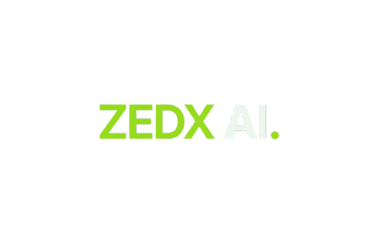
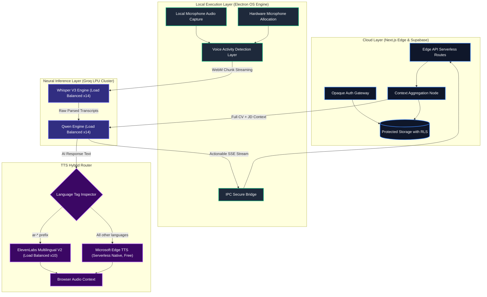
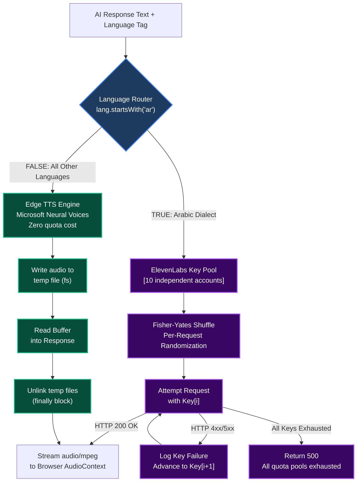
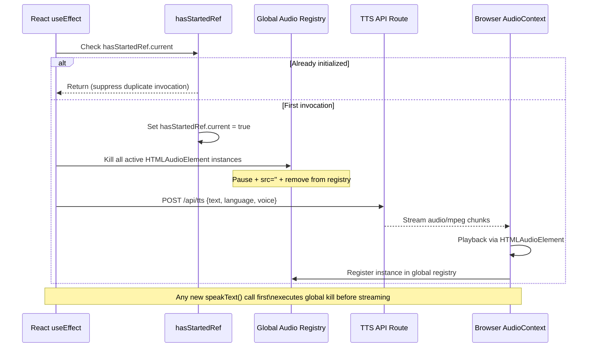
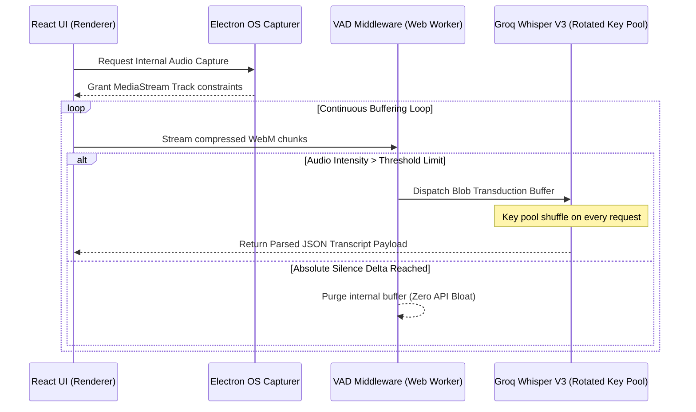
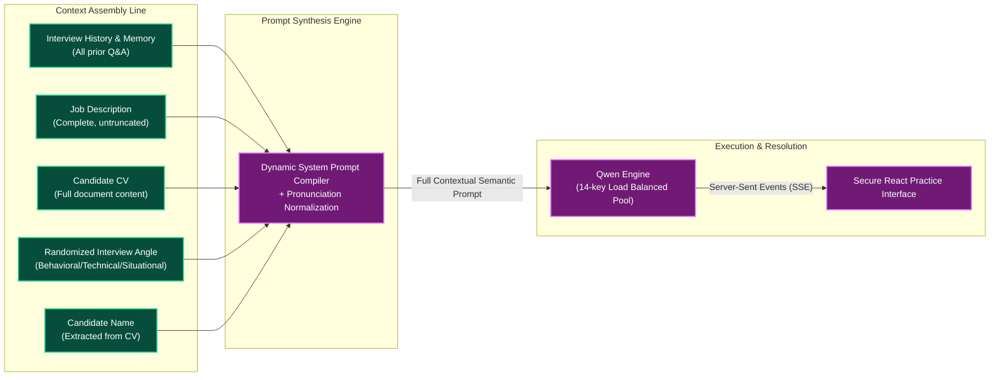
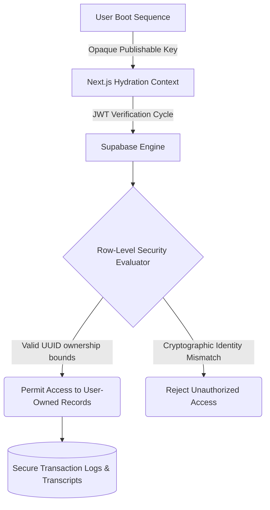
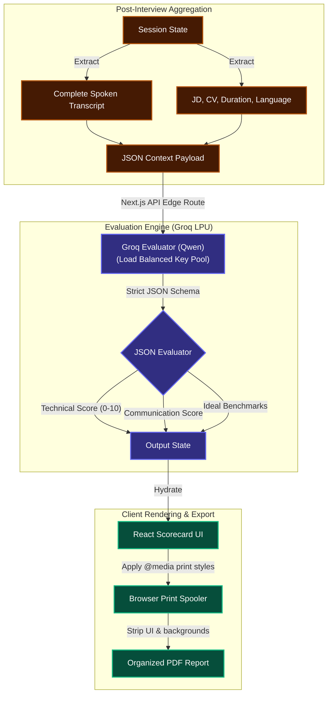
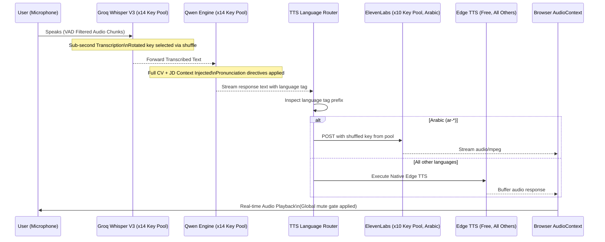

  
  <h1>ZEDX AI Simulator</h1>
  <h3>Professional AI Interview Simulation & Training Infrastructure</h3>

  <!-- Tech Stack Badges -->
  

    
    
    
    
    
    
    
  

## Executive Summary

**ZEDX AI Interview Simulator** is the world's most advanced **Voice-to-Voice AI Interviewer** and professional training platform engineered for rigorous candidate evaluation. Designed to help job seekers master their next interview, it provides a comprehensive **Dual-Mode** system (Web & Desktop) integrating real-time Speech-to-Text (STT), Large Language Model (LLM) inference, and a hybrid Text-to-Speech (TTS) engine.

- **The Web Simulator (Rigorous Evaluation Mode):** A strict, autonomous AI Mock Interview Simulator that conducts structured, context-aware interviews in **29+ supported languages**. 
- **The Desktop Sandbox (Assisted Learning Mode):** A Windows-native environment where the AI acts as a real-time copilot to accelerate skill acquisition and provide instant performance analytics.

---

## 1. Global Infrastructure Topology

---

## 2. TTS Hybrid Routing & Load Balancing Architecture

---

## 3. Audio Concurrency Control & Race Condition Elimination

---

## 4. Audio Telemetry & Sub-Second STT Engine

---

## 5. Cognitive Context Injection (Full-Document AI Interviewer)

### Architectural Value:
- **Zero Truncation Policy:** The LLM operates on the complete, untruncated candidate data (CV + JD) to ensure maximum personalization.
- **Pronunciation Normalization:** System prompts dynamically adjust for Arabic vs Latin scripts to prevent TTS mispronunciations.

---

## 6. Security Subsystem & State Persistence

### Security Enforcement
- **AI Prompt Injection Guard:** Encapsulation blocks malicious PDF resume instructions.
- **Row-Level Security Vaulting:** PostgreSQL policies mathematically bind data to verified users.
- **API Key Isolation:** All keys reside exclusively in server-side environments, using dynamic arrays for load balancing.

---

## 7. Advanced Performance Scorecard & PDF Pipeline

### Architectural Value:
- **Strict JSON Enforcement:** Forces the evaluation LLM to output predictable schema-validated JSON, preventing parsing crashes in the UI.
- **Client-Side Hydration & Export:** Heavy lifting (rendering and PDF compilation) is offloaded entirely to the client's browser, saving server-side compute.

---

## 8. Autonomous Voice-to-Voice Pipeline (Core Execution Loop)

---

### Engineered & Developed by Ziad Emad
*Committed to engineering strict software architectures that bridge the gap between autonomous ML deployments and instantaneous human accessibility.*
